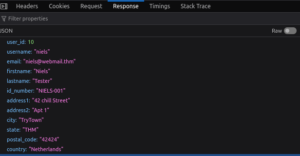
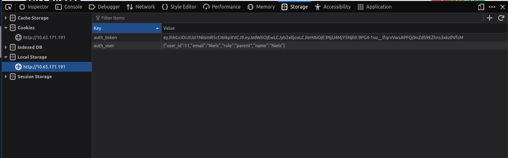
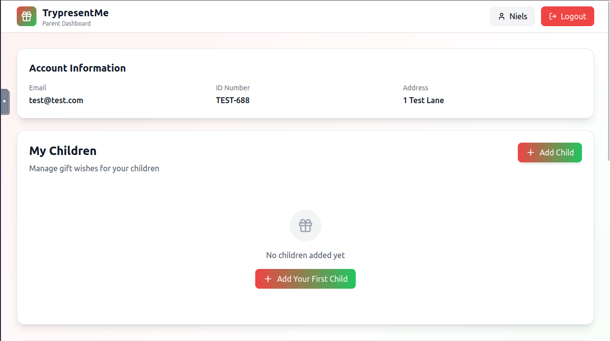

En este lab veremos la vulnerabilidad IDOR, una vulnerabilidad común en aplicaciones web, aunque prefiero llamarlo **aunthentication bypass** ya que es mas declarativo en la manera de como funciona la explotación de esta vulnerabilidad.  

IDOR es un ataque en la cual un usuario puede acceder a un recurso y el sistema no comprueba que esa persona es la dueña de ese recurso, y pueden *leakearse* información sensible de ese usuario y un ciberatacante podria aprovecharlo para sus fines.

Una vez que iniciamos la maquina victima ingresamos a la web con las credenciales del usuario que nos dan,  en este caso el usuario neils


```
usuario: Niels
password: TryHackMe#2025
```


Una vez dentro, en el dashboard si inpeccionamos la pagina y vamos al apartado de *network* vemos un *leak* del id de un usuario en este caso del usuario Neils.


Seleccionamos la peticion y vemos que en los encabezamos *http* , en la pestaña de response vemos los datos de ese usuario.




Luego si vamos en el apartado *Storage* -> *Local Storage*, vemos esta visible el *token* + un diccionario que contiene los datos de ese usuario, si manipulamos el id (por ejemplo el usuario con el id 11) y refrescamos la pagina vemos que repentinamente somos el usuario "test".







Como se menciono anteriormente, con la vulnerabilidad IDOR una persona puede acceder a datos, rutas, etc, sin autenticacion previa, por lo que una vez explotada la vulnerabilidad un usuario malicioso podria hacer 2 cosas. 

1. Escalamiento horizontal de privilegios: Poder ver datos de un usuario del mismo nivel de privilegios.
2. Escalamiento vertical de privilegios: Poder ver datos de un usuario con privilegios mas elevados (Datos administrativos).
